# CAPTCHA Bypass
Authors: Nicholas Leung, Pranavbhai Patel, Ray Coden Mercurius, Ravi Singh
 
## Table of Contents
1.0  Introduction	\
2.0  Illustration / Figure	\
3.0  Background & Related Work	\
4.0  Dataset Processing	\
5.0  Architecture	\
6.0  Baseline Model	\
7.0  Quantitative Results	\
8.0  Qualitative Results	\
9.0  Model Evaluation	\
10.0  Discussion	\
11.0  Ethical Considerations	\
12.0  Project Difficulty / Quality	\
   References	\
   Attribution Table

## 1.0 Introduction
Web security has become essential to the safety of its users and the reliability of its services. CAPTCHA tests often safeguard online resources from non-human user access and exploitation. CAPTCHA stands for “Completely Automated Public Turing test to tell Computers and Humans Apart”. It is a challenge-response test that prompts users to input an alphanumeric string based on a distorted image to confirm their authenticity, shown in Figure 1.

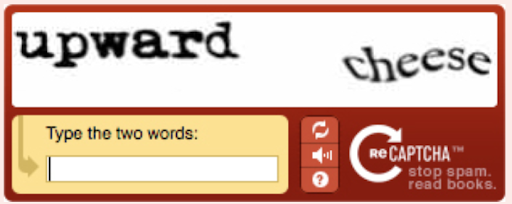

Figure 1: Online CAPTCHA Turing test sample
&nbsp;

However, CAPTCHA as a web security standard has become obsolete and susceptible to computer vision attacks, and has since been replaced by reCAPTCHA [1]. This development motivates the team’s efforts and interests to develop a CAPTCHA bypass system using machine learning methods.
\
The problem can be reduced to a multiclass classification problem coupled with object detection. First, each individual character in the CAPTCHA string is segmented and isolated. Next, each segmented image, of only a single character, is passed into the optical character recognition (OCR) model for classification into the predefined character space. A final guess is then formulated.

## 2.0 Illustration / Figure

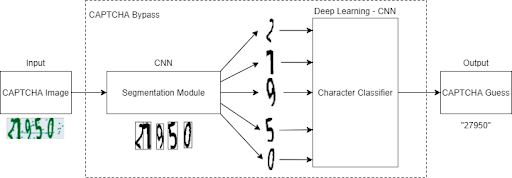

Figure 2: End-to-end system architecture
&nbsp;

## 3.0 Background & Related Work
Nouri and Rezai developed a customized convolutional neural network (CNN) model for CAPTCHA bypass [1]. The process can be summarized as preprocessing, encoding, and CNN processing. In the preprocessing stage, images are made uniform using image size reduction, colour space conversion, and noise reduction. The CNN consists of three alternating convolutional and max-pooling layers. From there, the output is passed through a 512-dense layer and L-separate Softmax layers, where L is the CAPTCHA code length. This customized CNN achieved a 98.94% accuracy on a test dataset of 500,000 CAPTCHA codes.

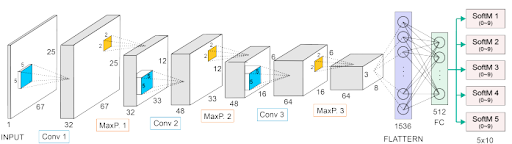

Figure 3: Nouri and Rezai’s customized deep learning architecture [1].
&nbsp;

Bursztein et al. proposed a reinforcement learning based algorithm for CAPTCHA bypass [2]. The algorithm determines all possible ways to segment a CAPTCHA code, and decides which combination is likely correct. Analyzing all possible segmentation paths allows the algorithm to find the segments that globally maximize recognition rate. The cut-point detector is responsible for finding all possible cuts along which to segment a CAPTCHA code into individual characters. The slicer then applies heuristics to extract meaningful potential segments based on cut points and builds a graph. The scorer traverses the graph and applies optical character recognition (OCR) to each potential segment and assigns a recognition confidence score using a modified KNN. The arbiter then selects the final value of the CAPTCHA, which is passed to the reinforcement learning algorithm. This approach was less successful than the deep learning approach, achieving a peak accuracy of 55% on the Baidu 2013 dataset.

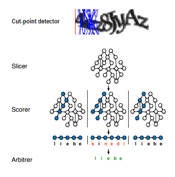

Figure 4: Bursztein et al.’s reinforcement learning architecture [2]
&nbsp;

## 4.0 Data Processing
Importance was placed on dataset selection to maximize model generalizability and image preprocessing to improve performance.
### 4.1 Dataset Generation
CAPTCHAs can vary in terms of character rotation, distance, font size, and added noise. Thus, a large dataset is needed to generalize to any CAPTCHA. The team decided to generate their own custom dataset using an open-source CAPTCHA generator [3]. This is because existing datasets were limited in character space, unbalanced in representation, and number of samples.
Dataset Characteristics:
/

- Alphanumeric character space, 36 classes (A-Z, 0-9).
- ~15,000 samples, examples shown in Figure 5.
- ~2,000 character samples per class, seen in Figure 6.
- 70/15/15 training/validation/test split.

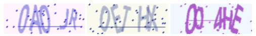

Figure 5: Sample CAPTCHAs from generated dataset
&nbsp;

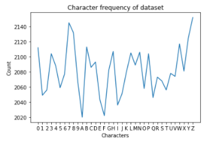

Figure 6: Class representation of generated dataset
&nbsp;
### 4.2 Preprocessing
CAPTCHAs are internally processed to remove irrelevant signals and simplify images to include only key information. The preprocessing is summarized in Figure 7.

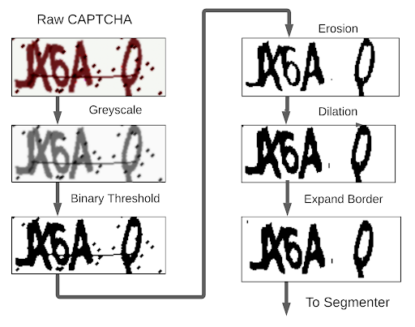

Figure 7: Visualization of CAPTCHA image preprocessing.
&nbsp;
 
### 4.3 Segmentation Dataset
An additional dataset was leveraged to implement the segmentation module. This dataset consisted of ~1,500 manually labelled character samples in which segmentation is nontrivial. We accelerated labelling by creating a labelling script as seen in Figure 8. Labels describe the correct horizontal distance at which to cut.

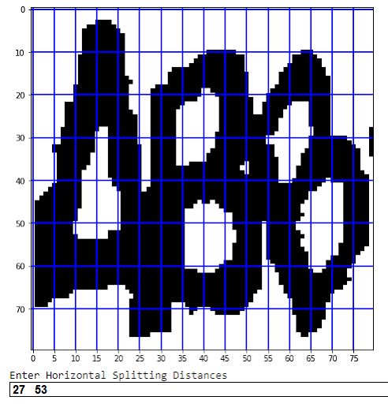

Figure 8: Data labelling program used for segmentation dataset.
&nbsp;
## 5.0 Architecture
### 5.1 Character Segmentation
Preprocessed CAPTCHA images are passed into cv2.findContours()[4] to draw bounding boxes around every object, but sometimes overlapping characters are grouped together. These are passed into the splitting model for further segmentation. At this point, the CAPTCHA is partitioned into five normalized, grayscale images.
The splitting model consists of four pairs of convolutional and max pooling layers, followed by two linear fully-connected layers. The model input is a bounding box containing overlapping characters. The output of the model is a 1x(N-1) set of coordinates at which to partition the image where N is the number of characters in the bounding box. The architecture is shown in Figure 9.
 
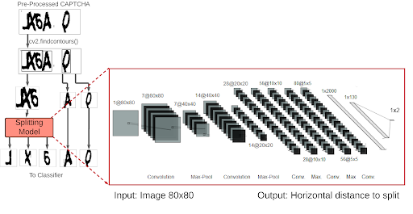

Figure 9: Architecture of Splitting Model
&nbsp;
### 5.2 Primary Classifier
The primary classifier consists of two pairs of convolutional and max pooling layers, followed by three linear fully-connected layers. Between the first two fully-connected layers, the team used dropout to reduce overfitting. The model input is a 1x80x80 grayscale image produced from the character segmentation model. The output of the model is a 1x36 distribution of probabilities. The 36 output classes are a result of the team constraining the CAPTCHA input to only include alphanumeric characters (0-9, A-Z). The architecture is shown in Figure 10.

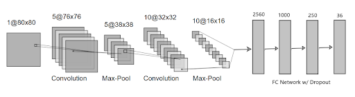

Figure 10: Primary classifier architecture
&nbsp;
## 6.0 Baseline Model
Like the primary model, the baseline model is also composed of a segmentation module and a classification module. The segmentation module leverages the same contouring approach, but when overlapping characters are captured within the same bounding box, the box is split into uniform segments as shown in Figure 11. The classification module uses SVM techniques to identify characters. This baseline model is suitable as it provides a comparison for the effectiveness of deep-learning in performing CAPTCHA bypass.

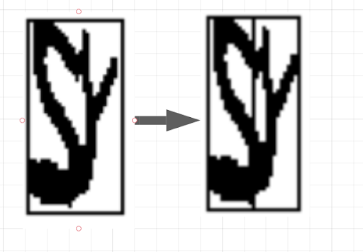

Figure 11: Equal-width splitting heuristic for overlapping characters.
&nbsp;
## 7.0 Quantitative Results
### 7.1 Segmentation Error
|          Model          | Two-Character Split Error | Three-Character Split Error |
|:-----------------------:|:-------------------------:|:---------------------------:|
|      Primary (CNN)      |            3.1%           |             4.4%            |
| Baseline (equal widths) |            4.5%           |             6.1%            |

Table 1: Average character segmentation error.
&nbsp;

Split error represents the percentage difference of the segmented character width from the true partition. The baseline model simply partitions overlapping characters evenly. The primary model has a CNN architecture and demonstrated more precise partitioning, which translates to improved classification.
 
 
 
### 7.2 Classification Accuracy
|            Model            | Character Accuracy | CAPTCHA Accuracy |
|:---------------------------:|:------------------:|:----------------:|
|        Primary (CNN)        |       90.67%       |      71.00%      |
|        Baseline (SVM)       |       83.84%       |      51.73%      |
| AlexNet (Transfer Learning) |       82.43%       |      45.23%      |

Table 2: Character and CAPTCHA accuracies of each classification model.
&nbsp;

The values from Table 2 were obtained experimentally for each model against the custom-generated test dataset, showing that the primary CNN model has the best performance.
Both accuracies are important to the CAPTCHA bypass system. The character accuracy represents the percentage of individual characters correctly identified. The CAPTCHA accuracy represents the percentage of CAPTCHA strings (five characters) correctly identified. This allows the team to evaluate the model in a non-binary fashion. For example, a model that always predicts four of the five CAPTCHA characters correctly would receive a 0% CAPTCHA accuracy. This is a skewed analysis because the model is not credited for its 80% character accuracy.
## 8.0 Qualitative Results
Overall, the experimental results were positive. The model was able to demonstrate the ability to semi-consistently read CAPTCHA images and output the corresponding character string. Figure 12 shows the confusion matrix generated from the primary model against the test dataset. The blue squares indicate high frequency of occurrences and gray squares indicate low frequency of occurrences. The blue squares along the diagonal of the matrix signify correct predictions. The most common error was the misinterpretation of the characters “O” and “0” (zero), which is reasonable given their similar lettering.

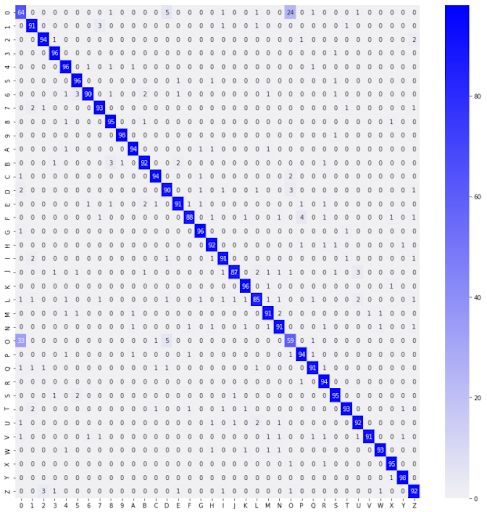

Figure 12: Confusion matrix of primary model on test dataset
&nbsp;
An end-to-end system was developed as an interface for the CAPTCHA bypass model. This allows users to provide a single CAPTCHA image as input to obtain the decoded string as output. The model proved fairly capable and reliably decodes separate, distinguishable CAPTCHA characters. On the other hand, the model can struggle when provided overlapping, ambiguous characters. Examples of both cases, correct (left) and incorrect (right) predictions, can be seen in Figure 13. The “MBRRU” string is more readable than the “4AWFY” string because the “AW” are overlapping.

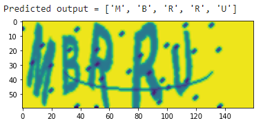 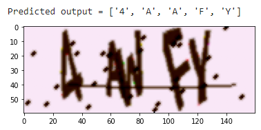 

Figure 13: CAPTCHA predictions
&nbsp;
## 9.0 Model Evaluation 
The team split the generated dataset into training, validation and test sets. A 70/15/15 random split was performed, resulting in the test dataset having roughly 2,250 CAPTCHAs. Since single-character classification heavily affects CAPTCHA accuracy, the model’s performance on the new data is valid only if the data has equal character representation. For example, if the test set lacked CAPTCHAs containing “0” or “O”, the accuracy would be higher than the true performance of the model. We ensure this is not the case and that all characters are represented as seen in Figure 14. The test set has the additional benefit of having new CAPTCHA values. For example, if “ABCDE” is a CAPTCHA string in the training set, that sequence is guaranteed to not appear in the test set. This property helps prove the generalizability of the model, specifically that it works on new character permutations. This is important because for a five-character CAPTCHA with an alphanumeric character set, there are over 60 million permutations.

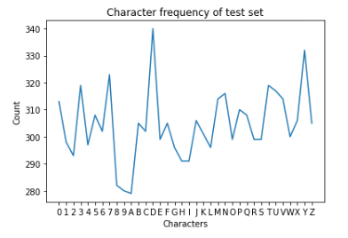 

Figure 14: Character class frequency of test set
&nbsp;

Overall, the model performed well and is generalizing well as both validation accuracy and test accuracy were similar. Reiterating Section 8.0, the final model achieved a CAPTCHA accuracy of 71% and a character accuracy of 90.67%.
 
## 10.0 Discussion
Despite achieving high character accuracy, the model underperforms in terms of CAPTCHA accuracy. This can be attributed to three main factors: compounding probabilities, segmentation issues, and character similarities.
&nbsp;

Compounding probabilities refers to the fact that character accuracy is not synonymous with CAPTCHA accuracy. For an N-length CAPTCHA string to be decoded, the model must correctly identify the N characters consecutively. This varies exponentially in proportion to character accuracy. For example, given a 90% character accuracy we would expect to see approximately a 60% CAPTCHA accuracy (0.95).
\
Character accuracy is also affected by similarities between characters. Consider the number “0” and the letter “O”. These characters are nearly identical, and it would make sense that they would be difficult for the model to distinguish. This is further proven by the confusion matrix, which depicts that most of the incorrect guesses were misclassifications of a “0” as an “O”, or vice versa.
\
Lastly, segmentation is a nontrivial problem. In the case of overlapping characters, regardless of how the image is sliced, vital character information is lost. In Figure 16, we observe that the letters “A” and “W” are overlapping. Depending on the slice taken, we would end up with letters that look like “F” and “W” or “A” and “N”. In either case, we would have to sacrifice the correct guess for one of the letters, which would ultimately result in an incorrect CAPTCHA guess.
&nbsp;

We learned how to effectively debug a complex machine learning system. Though the general procedure was similar to other software practices, the means by which it is done, e.g. confusion matrix, are different. They provide valuable insight into the model and/or data flaws.
\
In terms of future improvements, adding another layer to allow for the detection of extra features may resolve the confusion between similar characters such as “0” and “O.” Alternatively, a more robust segmentation model that performs non-vertical slices, as shown below in Figure 15, may also be worthwhile.

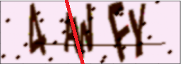 

Figure 15: Example of a more accurate non-vertical slice.
&nbsp;
 
## 11.0 Ethical Considerations
The design is malicious in its intent to autonomously bypass a web security mechanism. It can be leveraged as a hacking tool which jeopardizes online user privacy and safety.
\
Fortunately, the CAPTCHA generator and premade dataset are outdated (2015 and 2018 respectively). Since 2007, traditional text-based CAPTCHA has been widely replaced by the superior reCAPTCHA (Version 3). Thus, the ethical considerations of the project are outdated because CAPTCHA (Version 1) is no longer the Internet standard.
## 12.0 Project Difficulty / Quality
The solution to CAPTCHA bypass has two main components: segmentation and classification. Segmentation, or partitioning the CAPTCHA image into individual characters, is challenging because CAPTCHA images vary in terms of rotation, distance, font size, and noise. Multiclass classification for character recognition is simpler, however the sheer number of output classes (36) complicates the task.
&nbsp;

The broad variation of input makes a static segmentation strategy ineffective. As a result, Mercurius developed a CNN model to perform more precise vertical partitions. Yet, the model still struggled to split adjacent characters with significant overlap or rotation, that cannot be partitioned vertically.
&nbsp;

The primary CNN classification model performs well, attaining a test accuracy of 71%. However, the team implemented redundancy into the project plan and also developed baseline SVM and AlexNet transfer learning models. If the primary model yielded insufficient results, there were backup models to pursue.
&nbsp;

In summary, the project is an end-to-end architecture that successfully performs CAPTCHA bypass. The key challenges of the project were the deep learning segmentation module and custom dataset, and robustness was added via the classification model redundancy.

### References
[1] E. Bursztein, J. Aigrain, A. Moscicki, and J. Mitchell, “The End is Nigh: Generic Solving of Text-based CAPTCHAs,” USENIX. https://www.usenix.org/system/files/conference/woot14/woot14-bursztein.pdf. \
[2] Z. Noury and M. Rezaei, “Deep-CAPTCHA: a deep learning based CAPTCHA solver for vulnerability assessment,” arXiv.org, Jun. 24, 2020. https://arxiv.org/pdf/2006.08296.pdf. \
[3] H. Yang, “Captcha,” Github, May 13, 2020. https://github.com/lepture/captcha?fbclid=IwAR3eYlx5VzJYktuNmCg0shB3D4OAaquybyVfWpDlpKuWPYvjjTa-NUT8RvA. \
[4] M. T. Elahi, “Algorithm and concept behind finding contour in OpenCV,” Researchgate, 13-Aug-2016. [Online]. Available: https://www.researchgate.net/post/What_is_the_algorithm_and_concept_behind_finding_contour_in_openCV  [Accessed: 22-Mar-2021] \

 
### Attribution Table
|             Task             |      Assignee     |
|:----------------------------:|:-----------------:|
|         Introduction         |       Singh       |
|   Background & Related Work  |       Singh       |
|        Data Processing       | Patel / Mercurius |
|         Architecture         | Singh / Mercurius |
|        Baseline Model        | Patel / Mercurius |
|     Quantitative Results     |       Leung       |
|      Qualitative Results     |       Leung       |
|       Model Evaluation       |       Patel       |
|          Discussion          |       Singh       |
|    Ethical Considerations    |     Mercurius     |
| Project Difficulty / Quality |       Leung       |

